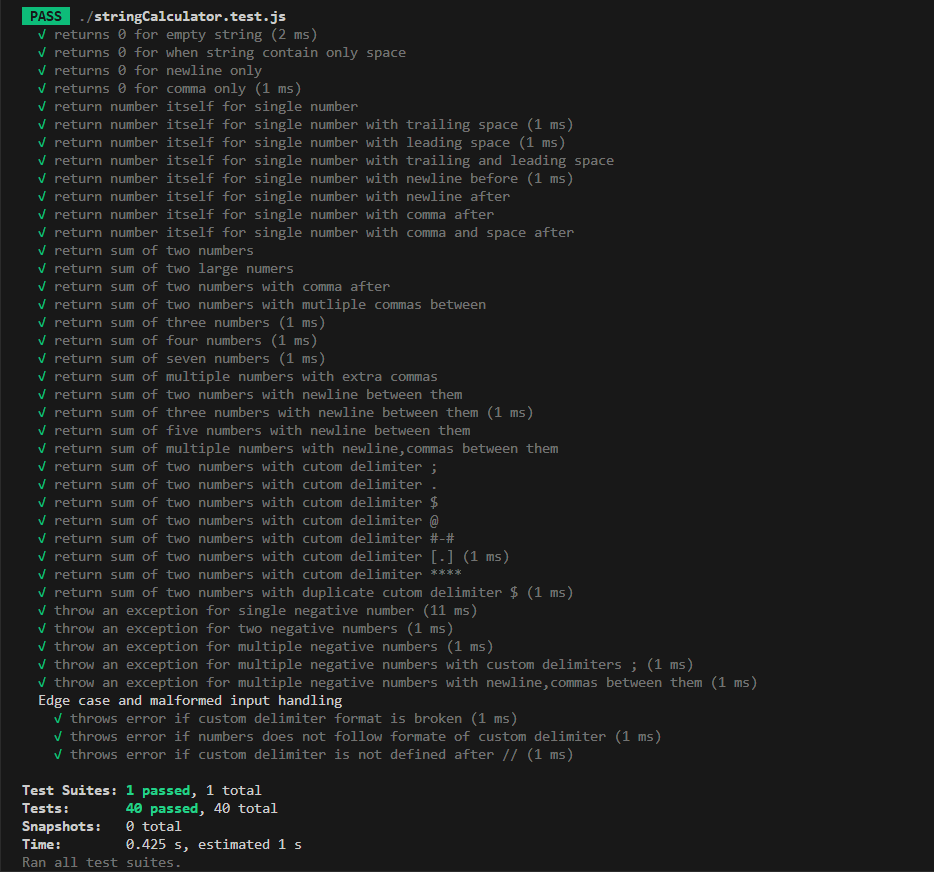

# 📐 String Calculator - TDD Kata

This project is an implementation of the classic **String Calculator Kata** using **Test-Driven Development (TDD)**. It includes both the calculator logic and comprehensive test coverage using **Jest**.

## 🚀 Features

- ✅ Returns `0` for an empty string or non-numeric input
- ✅ Handles one or more comma-separated numbers
- ✅ Supports newline (`\n`) as a delimiter
- ✅ Supports custom single or multi-character delimiters
- ✅ Handles malformed input and throws appropriate errors
- ✅ Throws exceptions for negative numbers and lists them in the message

---

## 🧪 TDD Approach

Each feature has been developed by following the **Red-Green-Refactor** cycle:

1. Write a failing test (Red) 🔴  
2. Write just enough code to make the test pass (Green) 🟢  
3. Refactor the code without changing behavior (Refactor) 🔁  

---

## 🧾 Examples

| Input                | Output | Notes                                 |
|---------------------|--------|---------------------------------------|
| `""`                | `0`    | Empty string                          |
| `"1"`               | `1`    | Single number                         |
| `"1,2"`             | `3`    | Two comma-separated numbers           |
| `"1\n2,3"`          | `6`    | Newline and comma delimiters          |
| `"//;\n1;2"`        | `3`    | Custom delimiter `;`                  |
| `"//****\n1****2"`  | `3`    | Multi-character delimiter             |
| `"1,-2,-4"`         | Error  | Exception with list of negative nums  |

---

## 🧪 Test Coverage

- ✅ Empty string, spaces, commas
- ✅ Single number (with/without spaces or newlines)
- ✅ Multiple numbers with comma/newline
- ✅ Custom delimiters: symbols, multi-char, brackets
- ✅ Negative number handling
- ✅ Malformed delimiter handling
- ✅ Unexpected delimiters

---
## 📂 Project Structure
### TDD-String-Calculator/
├── node_modules/               
├── .gitignore                  
├── package.json                
├── package-lock.json           
├── README.md                   
├── stringCalculator.js         
└── stringCalculator.test.js    

## 📸 Screenshots

###
This project was built as part of a TDD exercise. Feedback is welcome!